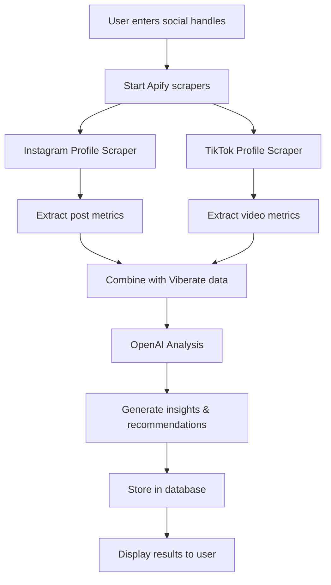

# 🚀 Apify Integration for Social Media Scraping

This document explains how the AI funnel uses Apify to scrape Instagram and TikTok data for comprehensive social media analysis.

## 📊 What Data We Extract

### **Instagram Data (via `apify/instagram-profile-scraper`)**
- **Post Metrics**: Likes, comments, views (for videos)
- **Content Types**: Photos, videos, reels, stories
- **Post Metadata**: Captions, hashtags, timestamps
- **Media URLs**: Image/video URLs for content analysis
- **Engagement Patterns**: Like-to-view ratios, comment engagement

**Sample Instagram Post Data:**
```json
{
  "platform": "instagram",
  "type": "reel",
  "caption": "New music video out now! 🎵 #newmusic #artist #viral",
  "likes": 1250,
  "comments": 45,
  "views": 8900,
  "timestamp": "2025-01-14T10:30:00.000Z",
  "hashtags": ["#newmusic", "#artist", "#viral"],
  "mediaUrl": "https://instagram.com/p/xyz/media"
}
```

### **TikTok Data (via `clockworks/free-tiktok-scraper`)**
- **Video Metrics**: Views, likes, comments, shares
- **Content Analysis**: Video descriptions, hashtags, audio tracks
- **Viral Indicators**: Share counts, view velocity
- **Engagement Rates**: Like/view ratios, comment/view ratios
- **Trend Analysis**: Hashtag performance, content themes

**Sample TikTok Post Data:**
```json
{
  "platform": "tiktok",
  "type": "video",
  "caption": "Behind the scenes of my latest track 🎶 #fyp #music #bts",
  "likes": 850,
  "comments": 32,
  "shares": 28,
  "views": 12500,
  "timestamp": "2025-01-14T15:45:00.000Z",
  "hashtags": ["#fyp", "#music", "#bts"],
  "mediaUrl": "https://tiktok.com/@user/video/123456"
}
```

### **Viberate Music Platform Data**
- **Artist Profile**: Name, bio, genre, country, verification status
- **Streaming Metrics**: Monthly listeners, track plays, playlist adds
- **Fanbase Analytics**: Follower growth, demographic breakdown
- **Geographic Data**: Fan distribution by country/city
- **Platform Performance**: Spotify, Apple Music, YouTube Music stats
- **Track Analytics**: Individual song performance metrics

## 🔧 Technical Implementation

### **Environment Variables Required**
```bash
# Apify Configuration
APIFY_TOKEN=your_apify_token_here
APIFY_BASE_URL=https://api.apify.com/v2

# OpenAI for Analysis
OPENAI_API_KEY=your_openai_key_here

# Viberate Integration
VIBERATE_API_KEY=your_viberate_key_here
```

### **Apify Actors Used**

1. **Instagram Scraper** (`apify/instagram-profile-scraper`)
   - Extracts up to 30 recent posts per user
   - Handles both public and business accounts
   - Respects Instagram's rate limits
   - Returns structured JSON data

2. **TikTok Scraper** (`clockworks/free-tiktok-scraper`)
   - Scrapes up to 30 recent videos per profile
   - Extracts engagement metrics and video metadata
   - Uses proxy rotation for reliability
   - Returns comprehensive video analytics

### **Data Flow**


## 📈 Analysis Features

### **Engagement Scoring**
- **Instagram**: Likes + Comments per post / Follower count
- **TikTok**: (Views + Likes + Shares) / Average for account
- **Cross-platform**: Consistency across platforms
- **Trending**: Hashtag performance and viral potential

### **Content Performance Analysis**
- **Best Performing**: Content types with highest engagement
- **Worst Performing**: Content types needing improvement
- **Optimal Timing**: Best posting times based on engagement patterns
- **Hashtag Strategy**: Most effective hashtags for reach

### **Growth Predictions**
Using machine learning analysis of:
- Historical posting frequency
- Engagement trend patterns
- Follower growth velocity
- Content type performance
- Cross-platform synergies

## 🛡️ Error Handling & Fallbacks

### **Robust Error Management**
- **API Failures**: Graceful fallback to mock data
- **Rate Limiting**: Automatic retry with exponential backoff
- **Timeout Handling**: 2-minute maximum wait per platform
- **Data Validation**: Clean and validate all scraped data

### **Mock Data Generation**
When Apify is unavailable:
- Generates realistic engagement metrics
- Creates proper hashtag distributions
- Maintains consistent data structure
- Ensures analysis can still provide value

## 🚨 Rate Limits & Costs

### **Apify Usage Limits**
- **Instagram**: ~1,000 requests/month on free tier
- **TikTok**: ~500 requests/month on free tier
- **Concurrent Runs**: Max 2 simultaneous scrapers

### **Cost Optimization**
- Only scrape when analysis is requested
- Cache results for 24 hours to avoid duplicate scraping
- Use efficient actor configurations
- Implement smart retry logic to avoid wasted runs

## 📋 Data Privacy & Compliance

### **Privacy Measures**
- Only scrape publicly available content
- No personal data collection
- Respect platform terms of service
- Automatic data cleanup after analysis

### **GDPR Compliance**
- User consent for data processing
- Right to deletion implementation
- Data minimization practices
- Transparent data usage policies

## 🔮 Future Enhancements

### **Planned Features**
- **YouTube Integration**: Add YouTube channel analysis
- **Historical Tracking**: Store data for trend analysis over time
- **Competitor Analysis**: Compare against similar artists
- **Content Recommendations**: AI-suggested content strategies
- **Automated Reporting**: Weekly/monthly insight emails

### **Advanced Analytics**
- **Sentiment Analysis**: Analyze comment sentiment
- **Visual Recognition**: Content type classification using AI
- **Trend Prediction**: Predict viral content opportunities
- **Audience Insights**: Deep demographic analysis

---

## 🛠️ Setup Instructions

1. **Get Apify Token**: Sign up at [apify.com](https://apify.com) and get your API token
2. **Add Environment Variables**: Set `APIFY_TOKEN` in your environment
3. **Test Integration**: Use the mock data mode first to test the flow
4. **Go Live**: Enable real scraping with your Apify token

The system automatically falls back to mock data if Apify is unavailable, ensuring the user experience remains smooth!